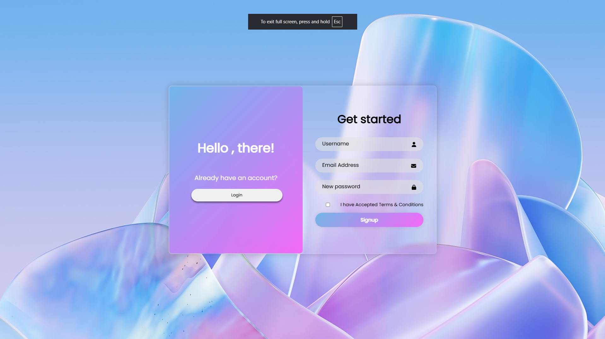
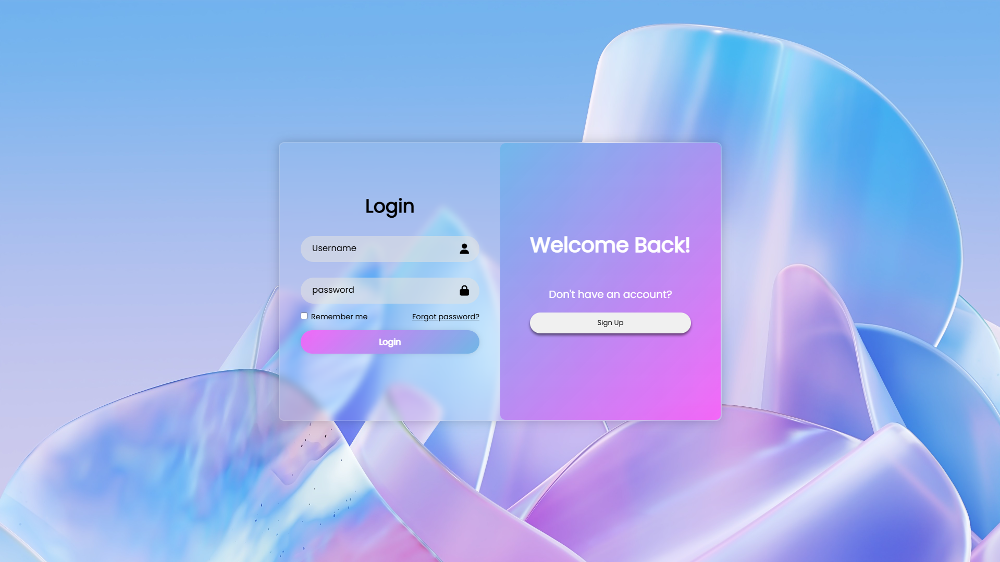

# Modern Glassmorphism Auth Interface

A sleek, interactive login and registration component built with HTML5 and CSS3. This project focuses on high-quality UI/UX through backdrop filters, smooth transitions, and engaging button physics.

##  Key Features
*   **Glassmorphism UI**: Uses `backdrop-filter: blur` and semi-transparent borders for a frosted-glass effect.
*   **Dynamic Overlay**: A smooth sliding transition between Login and Signup states.
*   **Interactive Animations**: 
    *   **PagePop**: Elements scale and fade in on page load.
    *   **Button Physics**: Hover "lift" and active "push" effects for a tactile feel.
    *   **Input Focus**: Interactive scaling and color shifts when selecting fields.
*   **Responsive Layout**: Centered Flexbox design that adapts to the viewport.
*   **Icon Integration**: Clean visual cues using Font Awesome.

##  Built With
*   **HTML5**: Semantic structure.
*   **CSS3**: Custom animations, Flexbox, and Root variables.
*   **JavaScript (ES6)**: State management for the sliding overlay.
*   **Google Fonts**: "Poppins" for a modern typographic feel.

##  Preview

🔗 **Live Demo**: [https://tharun-iitm.github.io/Login-signup-page/](https://tharun-iitm.github.io/Login-signup-page/)
